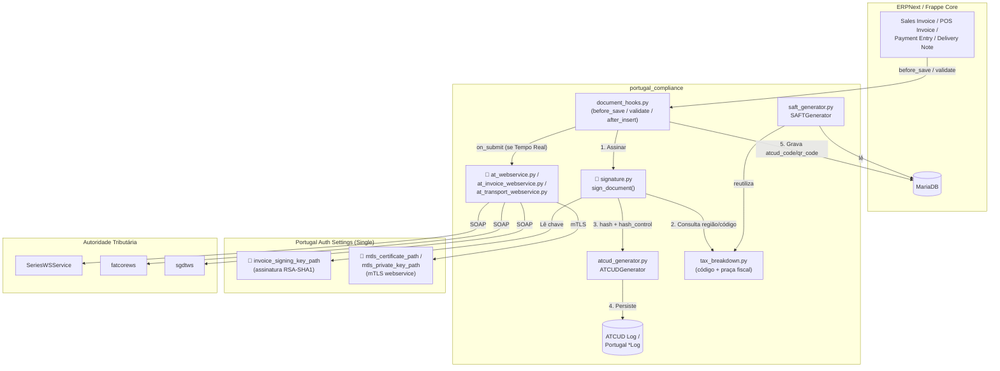
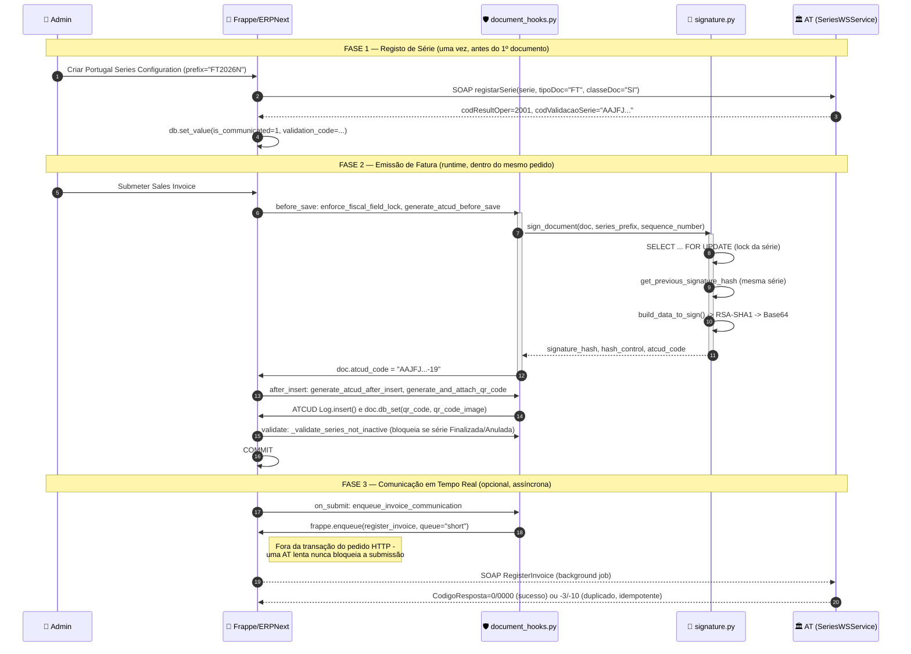
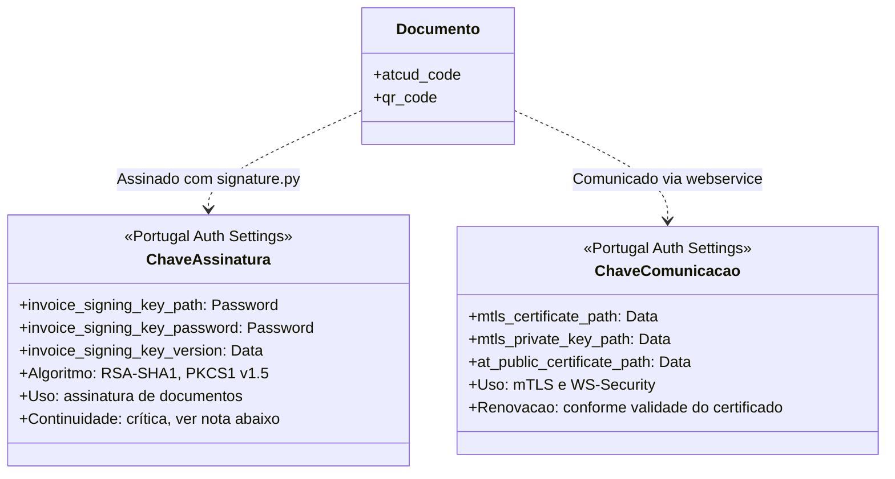
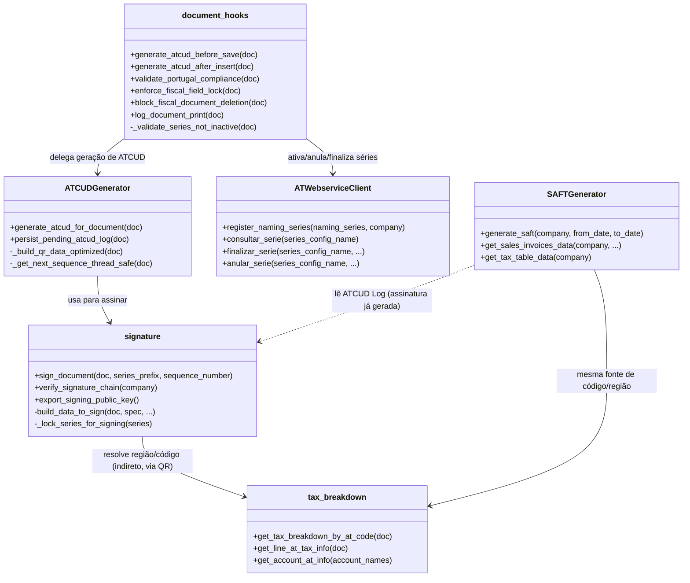
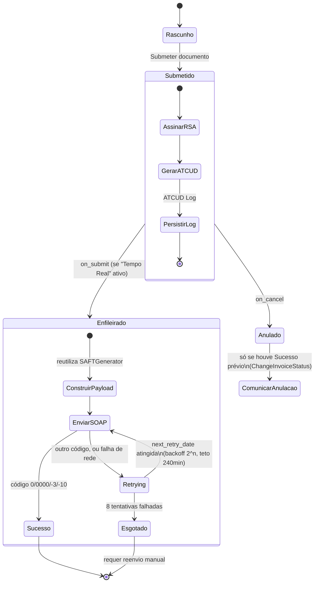

# Manual: Arquitetura Lógica de Comunicação e Certificação

Este documento apresenta a arquitetura lógica do módulo `portugal_compliance`, ilustrando o
fluxo de dados, a gestão de chaves e o ciclo de vida da comunicação com a Autoridade
Tributária (AT) — em diagramas Mermaid, fiéis ao mecanismo real de `hooks.py` do Frappe (não
a triggers de eventos genéricos nem a um middleware externo).

---

## 1. Visão Geral do Ecossistema

O módulo não é um plugin que intercepta chamadas externas — funde-se na árvore de execução
do próprio Frappe através de `doc_events` declarados em `hooks.py`. Cada submissão de
documento fiscal atravessa esta cadeia dentro da mesma transação de base de dados.

---

## 2. Ciclo de Vida do Documento (Sequence Diagram)

Do registo da série até à emissão e impressão de uma fatura, com os nomes reais das funções
envolvidas.

---

## 3. Arquitetura "Dual Key" (Segurança)

A separação entre a identidade "Fiscal" (assinatura de documentos) e a identidade "Técnica"
(autenticação de rede) é deliberada e explícita no schema de `Portugal Auth Settings` — não
duas pastas de ficheiros por convenção, mas dois grupos de campos distintos na mesma
configuração.

> **Continuidade da chave de assinatura**: `sign_document()` usa `invoice_signing_key_path`
> para calcular o hash RSA-SHA1 de cada documento. Trocar esta chave **não invalida**
> documentos já assinados, mas **rompe o encadeamento** para o próximo documento da série —
> `previous_signature_hash` deixa de poder ser recalculado a partir da chave antiga, pelo que
> a rotação de chave tem de ser feita com o mesmo cuidado de uma finalização de série.
>
> **Renovação da chave de comunicação**: os certificados mTLS/AT (`mtls_certificate_path`,
> `mtls_private_key_path`, `at_public_certificate_path`) devem ser renovados conforme a
> validade emitida pela entidade certificadora — ao contrário da chave de assinatura, a sua
> renovação não tem qualquer efeito sobre documentos já emitidos, porque não participa no
> cálculo do hash fiscal.

> **Nota de fidelidade ao código**: ao contrário de convenções de pastas fixas
> (`saft/production/`, `webservice/production/`), este módulo **não impõe** uma estrutura de
> diretórios para os ficheiros de chave/certificado — cada caminho é um campo de texto livre
> em `Portugal Auth Settings`, resolvido em runtime. A responsabilidade de organizar os
> ficheiros no sistema de ficheiros do servidor (permissões, localização fora da webroot) é
> do administrador de sistema. Ver
> [manual_tecnico_devops_certificados.md](manual_tecnico_devops_certificados.md) para uma
> convenção recomendada.

---

## 4. Estrutura de Módulos e Dependências

---

## 5. Comunicação em Tempo Real — Estados

---

## 6. Diferenças Face ao Modelo de Referência (Dolibarr)

| Aspeto | Módulo de Referência (Dolibarr) | `portugal_compliance` (Frappe) |
| :--- | :--- | :--- |
| Mecanismo de interceção | Triggers de evento (`BILL_VALIDATE`, `SHIPPING_VALIDATE`) + injeção de JS para esconder botões | `doc_events` declarativos em `hooks.py`, bloqueio ao nível do servidor (`frappe.throw`), sem dependência de JavaScript |
| Armazenamento de dados fiscais | Tabelas dedicadas (`llx_compliance_portugal_data`, `_series`) | DocTypes nativos do Frappe (`ATCUD Log`, `Portugal Series Configuration`), com toda a infraestrutura de permissões/auditoria do framework incluída |
| Modelos PDF | Cópia de ficheiros `.php` para a árvore `core/` do Dolibarr na ativação do módulo | Registos `Print Format` nativos, versionados como fixture (`fixtures/print_format.json`) |
| Validação SAF-T | XSD 1.0 implícito (biblioteca PHP padrão) | XSD 1.1 explícito (`xmlschema.XMLSchema11`) — necessário porque o schema real da AT declara `vc:minVersion="1.1"` |
| Retry de comunicação | Não documentado no material de referência | Backoff exponencial explícito (`2^n` min, teto 240 min), processado por tarefa agendada horária |

---

**Ver também**: [manual_funcionalidades_compliance.md](manual_funcionalidades_compliance.md)
(visão funcional), [manual_tecnico_series_atcud.md](manual_tecnico_series_atcud.md) (detalhe
de implementação da assinatura e séries),
[manual_tecnico_comunicacao_documentos_at.md](manual_tecnico_comunicacao_documentos_at.md)
(detalhe dos webservices).
