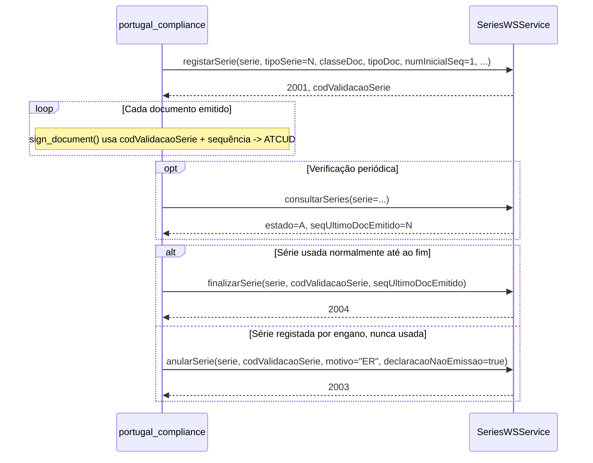

# Manual Técnico de Integração: Webservice de Séries Documentais (AT)

**Versão:** 1.1.0

Este documento detalha o contrato SOAP/WSDL do webservice `SeriesWSService` da Autoridade
Tributária e a sua implementação em `portugal_compliance`. Complementa
[manual_tecnico_series_atcud.md](manual_tecnico_series_atcud.md) (ciclo de vida completo,
incluindo assinatura) focando-se exclusivamente na mecânica de integração SOAP em si —
público-alvo: quem precise de depurar um pedido/resposta específico ou implementar uma nova
operação sobre o mesmo webservice.

---

## 1. Visão Geral

* **Protocolo**: SOAP 1.1, via [zeep](https://docs.python-zeep.org/) (não `SoapClient` nativo
  nem `suds`).
* **Endpoint de testes**: `https://servicos.portaldasfinancas.gov.pt:722/SeriesWSService`
* **Endpoint de produção**: `https://servicos.portaldasfinancas.gov.pt:422/SeriesWSService`
* **WSDL**: [wsdl/Comunicacao_Series.wsdl](portugal_compliance/wsdl/Comunicacao_Series.wsdl)
  — bundled no repositório, nunca obtido por download em runtime.
* **Autenticação**: mTLS + cabeçalho WS-Security proprietário — ver
  [manual_tecnico_devops_certificados.md](manual_tecnico_devops_certificados.md), secção 3.
* **Cliente**: `get_series_webservice_client(username=None, password=None)` em
  [utils/at_webservice.py](portugal_compliance/utils/at_webservice.py) — devolve
  `(zeep_service, wsse_header_element)`; o cabeçalho tem de ser reconstruído a cada chamada
  (nonce/timestamp de uso único).

---

## 2. Operações do Webservice

O WSDL expõe 4 operações; todas as 4 estão implementadas em `ATWebserviceClient`.

| Operação | Método Python | Objetivo |
| :--- | :--- | :--- |
| `registarSerie` | `register_naming_series()` | Comunicar uma série nova, obter código de validação |
| `consultarSeries` | `consultar_serie()` | Consultar o estado real de uma série já comunicada |
| `finalizarSerie` | `finalizar_serie()` | Encerrar formalmente uma série usada |
| `anularSerie` | `anular_serie()` | Desfazer um registo por erro (sem documentos emitidos) |

### 2.1. `registarSerie`

**Parâmetros** (`xsd:complexType`): `serie` (identificador, ≤35 caracteres),
`tipoSerie` (`N`=Normal/`F`=Formação/`R`=Recuperação), `classeDoc` (2 letras),
`tipoDoc` (2 letras), `numInicialSeq`, `dataInicioPrevUtiliz`, `numCertSWFatur`,
`meioProcessamento` (`PI`=Programa Informático/`PF`=Portal das Finanças/`OM`=Outros).

**Códigos de retorno confirmados**:

| Código | Significado |
| :--- | :--- |
| `2001` | Sucesso — devolve `codValidacaoSerie` |
| `4001` | Série já registada para este tipo de documento |
| `4002` | Campos obrigatórios em falta |
| `4003` | Erros de validação em campos preenchidos |
| `4043` | NIF sem atividade aberta na AT |
| `4045` | Classe do documento não corresponde a um valor predefinido (ver secção 3) |
| `4046` | Tipo de documento não corresponde à classe indicada |
| `4049` | Data de início prevista anterior à data atual |
| `5000` | Erro técnico não especificado |

### 2.2. `consultarSeries`

Único operação com todos os parâmetros opcionais — permite consultar por qualquer
combinação de `serie`, `tipoSerie`, `classeDoc`, `tipoDoc`, `codValidacaoSerie`, intervalo de
datas, `estado`, `meioProcessamento`. Devolve uma lista (`0..n`) de `seriesInfo`. Usado neste
sistema pelo botão "Verificar Status AT" (`consultar_serie()` filtra o resultado à série
específica pedida).

Campos de resposta relevantes por série: `serie`, `tipoSerie`, `classeDoc`, `tipoDoc`,
`numInicialSeq`, `seqUltimoDocEmitido`, `codValidacaoSerie`, `dataRegisto`, `estado`
(`A`=Ativa/`N`=Anulada/`F`=Finalizada), `motivoEstado`, `dataEstado`, `nifComunicou`.

### 2.3. `finalizarSerie`

**Parâmetros**: `serie`, `classeDoc`, `tipoDoc`, `codValidacaoSerie`, `seqUltimoDocEmitido`
(obrigatório — o último número efetivamente emitido), `justificacao` (opcional, texto livre,
≤4000 caracteres).

**Código de sucesso confirmado**: `2004` ("Série finalizada com sucesso").

```python
seq_ultimo_doc_emitido = max(int(series_config.current_sequence or 1) - 1, 0)
response = service.finalizarSerie(
    serie=at_series_format, classeDoc=..., tipoDoc=...,
    codValidacaoSerie=series_config.validation_code,
    seqUltimoDocEmitido=int(seq_ultimo_doc_emitido),
    justificacao=justificacao or "",
    _soapheaders=[wsse_header],
)
```

### 2.4. `anularSerie`

**Parâmetros**: `serie`, `classeDoc`, `tipoDoc`, `codValidacaoSerie`, `motivo` (código fixo de
**2 caracteres** — não texto livre, ver secção 4), `declaracaoNaoEmissao` (`xsd:boolean`,
obrigatoriamente `true`).

**Código de sucesso confirmado**: `2003` ("Série anulada com sucesso").

**Regras legais** (Manual de Integração de Software oficial da AT, secção 2.2.1), validadas
localmente antes de gastar uma chamada de rede:

* Só é possível anular uma série no estado **"Ativa"** (nunca "Finalizada").
* Só é possível anular no **próprio dia** da comunicação ou no **dia seguinte**.
* `declaracaoNaoEmissao` atesta que **nenhum documento** foi emitido com a série — uma
  declaração falsa não deve ser submetida mesmo em sandbox.

```python
if series_config.communication_date:
    dias = (frappe.utils.now_datetime().date() - get_datetime(series_config.communication_date).date()).days
    if dias > 1:
        return {"success": False, "error": _("Só é possível anular uma série comunicada no próprio dia ou no dia imediatamente anterior...")}
```

---

## 3. Mapeamento `tipoDoc` → `classeDoc`

A AT valida rigorosamente a correspondência entre estes dois campos — uma incoerência
devolve erro `4045` ou `4046`. Tabela completa, extraída do Manual de Integração de Software
oficial e do módulo de referência Dolibarr:

```python
DOC_CODE_TO_CLASS = {
    "FT": "SI", "FS": "SI", "FR": "SI", "NC": "SI", "ND": "SI",  # Sales Invoices
    "GT": "MG", "GR": "MG", "GD": "MG", "GC": "MG", "GM": "MG",  # Movement of Goods
    "RC": "PY", "RB": "PY", "RG": "PY",                          # Payments
}
```

| `classeDoc` | Significado | `tipoDoc` válidos (oficial) |
| :--- | :--- | :--- |
| **SI** | Faturas e documentos retificativos | FT, FS, FR, ND, NC |
| **MG** | Documentos de Transporte | GR, GT, GA, GC, GD |
| **WD** | Documentos de Conferência | CM, CC, FC, FO, NE, OU, OR, PF, RP, RE, CS, LD, RA |
| **PY** | Recibos | RC, RG |

Este sistema só usa efetivamente **SI** (Sales Invoice, POS Invoice), **MG** (Delivery Note)
e **PY** (Payment Entry) — os restantes tipos/classes da tabela oficial (WD e a maioria dos
códigos MG/SI) não têm série provisionada nem DocType correspondente.

---

## 4. Código de Motivo de Anulação — Vocabulário Fechado

O campo `motivo` de `anularSerie` **não é texto livre**: o XSD restringe-o a `length=2`, e o
Manual de Integração de Software oficial (secção 1.3.10) documenta **um único** valor
conhecido:

| Código | Descrição |
| :--- | :--- |
| **ER** | Anulação por erro de registo |

Confirmado ao vivo: submeter texto livre neste campo produz um SOAP Fault genérico
("Erro - Pedido do Cliente"), não um erro funcional interpretável; submeter um código de 2
caracteres não documentado (ex: `"01"`) produz o erro funcional `4051` ("O valor indicado no
motivo de anulação deve corresponder a um valor pré-definido"). Só `"ER"` foi confirmado
aceite pela AT em sandbox.

---

## 5. Construção do Identificador de Série

Regras confirmadas contra o Manual de Integração de Software oficial (secção 1.3.2):

* Comprimento máximo: 35 caracteres.
* Apenas `[A-Za-z0-9._-]`.
* Sem separador no início/fim, sem separadores consecutivos.
* **Nunca** iniciado por `"AT"` — reservado a programas da própria AT.
* Depois de anulada, uma série não pode ser reutilizada com o mesmo identificador para o
  mesmo `classeDoc`/`tipoDoc`.

Validação local, antes de contactar a AT
([utils/at_webservice.py](portugal_compliance/utils/at_webservice.py)):

```python
pattern = r'^([A-Z]{2,4})(\d{4})([A-Z0-9]{1,4})\.####$'
valid_doc_codes = ["FT","FS","FR","NC","ND","FC","RC","RG","RB","GT","GR","GM","JE","LC","OR","EC","EF","MR"]
```

---

## 6. Workflow Completo (Registo → Uso → Fecho)



---

## 7. Resolução de Problemas

| Sintoma | Causa | Solução |
| :--- | :--- | :--- |
| `4045` ao registar série | `classeDoc` inventado ou incoerente com `tipoDoc` | Usar exclusivamente a tabela da secção 3 — não improvisar códigos. |
| `4046` ao registar série | `tipoDoc` não pertence à `classeDoc` indicada | Confirmar o par na tabela oficial (secção 3). |
| SOAP Fault genérico ("Erro - Pedido do Cliente") em `anularSerie` | Campo `motivo` com texto livre em vez de código de 2 caracteres | Usar `"ER"` — o único valor documentado. |
| `4051` em `anularSerie` | Código de 2 caracteres não reconhecido pela AT | Confirmar que é exatamente `"ER"`; não há outro valor documentado publicamente. |
| `anularSerie` recusado sem sequer contactar a AT | Comunicação há mais de 1 dia, ou série já Finalizada | Regra legal — usar `finalizarSerie` se a série já foi usada. |
| Resposta da AT sem `codValidacaoSerie` mas com código de sucesso | Resposta `consultarSeries` sem correspondência (`found=False`) | Confirmar que o `series_at_format` pedido bate exatamente com o identificador registado (maiúsculas são normalizadas pela AT, mas o resto do formato não). |

---

**Ver também**: [manual_tecnico_series_atcud.md](manual_tecnico_series_atcud.md) para o
detalhe de como o código de validação alimenta a assinatura e o ATCUD, e
[manual_tecnico_devops_certificados.md](manual_tecnico_devops_certificados.md) para a
autenticação mTLS/WS-Security partilhada por todos os webservices da AT usados neste módulo.
