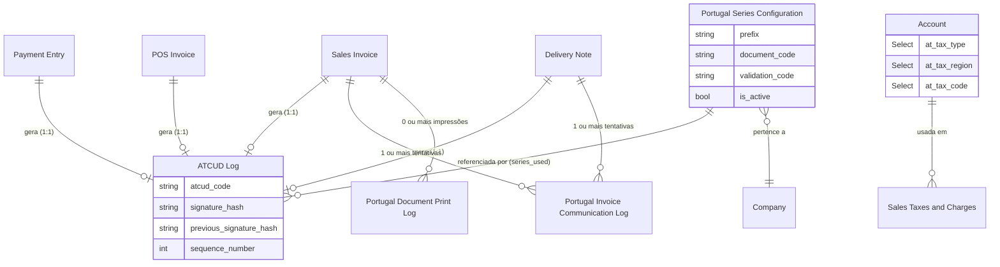

# Manual Técnico: Estrutura de Dados (DocTypes)

Referência completa do modelo de dados do módulo `portugal_compliance`. Ao contrário de um
módulo que introduz tabelas SQL dedicadas fora do ORM da plataforma, cada entidade aqui é um
**DocType nativo do Frappe** — herda automaticamente permissões por role, Track Changes,
API REST, e o mecanismo de fixtures para versionamento em Git. Não existem tabelas
`llx_compliance_*` equivalentes; a persistência é feita através do ORM do Frappe
(`tabPortugal Series Configuration`, `tabATCUD Log`, etc., geradas automaticamente a partir
do schema JSON de cada DocType).

---

## 1. Visão Geral

| DocType | Tipo Frappe | Papel |
| :--- | :--- | :--- |
| `Portugal Auth Settings` | Single | Configuração central (credenciais, chaves, modo) |
| `Portugal Series Configuration` | Documento | Uma série documental por (empresa, DocType, prefixo) |
| `ATCUD Log` | Documento (log) | Um registo por documento fiscal assinado |
| `SAF-T Export Log` | Documento (log) | Um registo por exportação SAF-T |
| `Portugal Invoice Communication Log` | Documento (log) | Um registo por tentativa de comunicação em tempo real (faturas + transporte) |
| `Portugal Document Print Log` | Documento (log) | Um registo por impressão de documento fiscal |
| `AT Tax Exemption` | Documento (referência) | Taxonomia de códigos de isenção de IVA (M01-M99) |

Adicionalmente, o módulo estende `Account` (DocType nativo do ERPNext) com 3 Custom Fields
fiscais — ver secção 8.

---

## 2. `Portugal Auth Settings` (Single)

`permissions`: `System Manager` — `read`/`write`/`create` apenas (sem `delete`/`email`/
`export`/`print`/`report`/`share`).

| Campo | Tipo | Descrição |
| :--- | :--- | :--- |
| `ssl_certificate_path` | Password | Caminho para o certificado `.pfx` da AT (legado/setup inicial) |
| `certificate_password` | Password | Password do certificado acima |
| `at_webservice_url` | Data | URL base do webservice (default sandbox) |
| `sandbox_mode` | Check | `1` = ambiente de testes (default) |
| `session_tokens` | Table (`Portugal Session Token`) | Tokens de sessão, se aplicável ao fluxo de autenticação |
| `invoice_signing_key_path` | Data | Caminho da chave privada RSA de assinatura (PEM) |
| `invoice_signing_key_password` | Password | Password da chave privada de assinatura |
| `invoice_signing_key_version` | Data | Versão da chave, para auditoria em caso de rotação |
| `software_certificate_number` | Data | Número de certificado atribuído pela AT (`"0"` enquanto não certificado) |
| `cash_vat_scheme` | Check | Regime de IVA de Caixa (Artigo 78.º-A do CIVA) — determina `PaymentType` (RC/RG) no SAF-T |
| `at_username` / `at_password` | Data / Password | Credenciais do sub-utilizador WSE/WDT da AT |
| `mtls_certificate_path` / `mtls_private_key_path` | Data | Par mTLS para autenticação de rede |
| `at_public_certificate_path` | Data | Certificado público da AT (cifra do bloco WS-Security) |
| `invoice_communication_method` | Select | `Offline (SAF-T Mensal)` (default) / `Tempo Real (Webservice)` |
| `transport_communication_method` | Select | `Tempo Real (Webservice)` (default) / `Desativado` |

---

## 3. `Portugal Series Configuration`

| Campo | Tipo | Descrição |
| :--- | :--- | :--- |
| `series_name` | Data | Nome descritivo (obrigatório) |
| `company` | Link (Company) | Empresa (obrigatório) |
| `document_type` | Select | DocType do ERPNext associado (obrigatório) — inclui opções fora do âmbito fiscal atual (Purchase Invoice, Stock Entry, Journal Entry, etc.), mantidas por compatibilidade histórica |
| `prefix` | Data | Prefixo real, sem hífenes (ex: `RG2026N`) (obrigatório) |
| `naming_series` | Data | `{prefix}.####` |
| `is_active` | Check | `0` após finalização ou anulação — bloqueia fisicamente novos documentos (`_validate_series_not_inactive`) |
| `current_sequence` | Int | Sequência corrente (informativa — a alocação real vem do contador nativo do Frappe) |
| `total_documents_issued` | Int | Contagem de documentos emitidos |
| `last_document_date` / `last_document_name` | Date / Data | Último documento emitido |
| `next_sequence_preview` | Data | Pré-visualização do próximo número (UI) |
| `sample_atcud` | Data | Exemplo de ATCUD (UI) |
| `is_communicated` | Check | `1` após `registarSerie` bem-sucedido; volta a `0` após `anularSerie` |
| `communication_date` | Datetime | Data/hora da comunicação — usada na validação do prazo de 1 dia para `anularSerie` |
| `communication_attempts` / `last_communication_attempt` | Int / Datetime | Telemetria de tentativas |
| `validation_code` | Data | `codValidacaoSerie` devolvido pela AT — `None` após anulação |
| `at_environment` | Select | `Produção` / `Teste` |
| `communication_response` | Long Text | Última resposta bruta da AT |
| `last_at_check` | Datetime | Última consulta via `consultarSeries` |
| `document_code` | Data | Código real do tipo de documento (FT/NC/FS/RG/GR/...) — **fonte de verdade** usada em todo o módulo (SAF-T, QR Code, comunicação em tempo real) |
| `year_code` / `company_code` | Data | Componentes do prefixo |
| `full_prefix_breakdown` / `naming_pattern` / `atcud_pattern` | Long Text / Data | Campos informativos de UI |
| `notes` / `technical_notes` | Text Editor / Long Text | Anotações livres |

---

## 4. `ATCUD Log`

| Campo | Tipo | Descrição |
| :--- | :--- | :--- |
| `document_type` | Link (DocType) | Doctype do documento assinado |
| `document_name` | Dynamic Link | Nome do documento assinado |
| `document_date` | Date | Data do documento |
| `company` | Link (Company) | Empresa |
| `series_used` | Link (Portugal Series Configuration) | Série usada — chave para reconstrução da cadeia |
| `fiscal_year` | Link (Fiscal Year) | Ano fiscal |
| `atcud_code` | Data | ATCUD completo (`validation_code-sequência`) |
| `validation_code_used` | Data | Código de validação no momento da geração |
| `sequence_number` | Int | Sequência dentro da série |
| `generation_status` | Select | `Success` / `Failed` / `Pending` / `Retrying` |
| `generation_date` | Datetime | Momento da geração |
| `processing_time` | Float | Duração da geração (telemetria) |
| `signature_hash` | Small Text | Assinatura RSA-SHA1 completa (Base64) |
| `previous_signature_hash` | Small Text | Hash do documento anterior da mesma série |
| `signature_hash_control` | Data | 4 caracteres de controlo (campo `Q` do QR Code) |
| `signing_key_version` | Data | Versão da chave usada — auditoria de rotação |
| `qr_code_string` | Small Text | ⚠️ Ver nota de inconsistência em [manual_tecnico_qrcode.md](manual_tecnico_qrcode.md), secção 5 |
| `error_message` / `error_traceback` | Text / Code | Diagnóstico em caso de falha |
| `retry_count` / `last_retry_date` / `next_retry_date` | Int / Datetime | Retry de persistência pendente (`persist_pending_atcud_log`) |
| `created_by_user` / `ip_address` / `user_agent` | Link (User) / Data / Text | Metadados de auditoria |
| `erpnext_version` / `module_version` | Data | Versões no momento da geração |

**Fonte de dados de `verify_signature_chain()`** — só entradas com `generation_status =
"Success"` participam na verificação.

---

## 5. `SAF-T Export Log`

| Campo | Tipo | Descrição |
| :--- | :--- | :--- |
| `naming_series` | Select | `SAFT-EXP-.YYYY.-.####` |
| `company` | Link (Company) | Empresa (obrigatório) |
| `from_date` / `to_date` | Date | Período exportado (obrigatório) |
| `export_type` | Select | `Full` / `Invoicing` / `Accounting` / `Movement of Goods` / `AT Communication` (obrigatório) |
| `status` | Select | `Pending` → `In Progress` → `Completed` \| `Failed` \| `Cancelled` (obrigatório) |
| `xml_validation_status` | Select | `Not Validated` / `Valid` / `Invalid` / `Validation Error` |
| `xsd_validation_errors` | Long Text | Lista de erros reais do XSD (até 50 ocorrências / 5000 caracteres) |
| `file_path` / `file_size` / `file_hash` | — | Localização, tamanho e SHA-256 do ficheiro gerado |
| `total_records` | — | Contagem de registos incluídos |

`download_saft_file` (api/saft_api.py) recusa servir qualquer registo cujo `status` não seja
`"Completed"`.

---

## 6. `Portugal Invoice Communication Log`

Partilhado entre Faturação (Sales Invoice/POS Invoice) e Transporte (Delivery Note) — o nome
do doctype ficou "Invoice" por ter sido o primeiro fluxo implementado.

| Campo | Tipo | Descrição |
| :--- | :--- | :--- |
| `naming_series` | Select | `INV-COMM-.YYYY.-.#####` |
| `document_type` | Link (DocType) | Sales Invoice / POS Invoice / Delivery Note (obrigatório) |
| `document_name` | Dynamic Link | Nome do documento (obrigatório) |
| `company` | Link (Company) | Empresa (obrigatório) |
| `status` | Select | `Pending` / `Success` / `Failed` / `Retrying` (obrigatório) |
| `retry_count` | Int | Tentativas efetuadas |
| `last_attempt_date` / `next_retry_date` | Datetime | Controlo do backoff exponencial |
| `at_response_code` / `at_response_message` | Data / Small Text | Resposta da AT (código + mensagem amigável) |
| `request_payload` | Code (JSON) | Payload enviado — para diagnóstico |
| `raw_response` | Code | Resposta SOAP bruta (serializada) |

---

## 7. `Portugal Document Print Log`

| Campo | Tipo | Descrição |
| :--- | :--- | :--- |
| `naming_series` | Select | `PRINT-.YYYY.-.#####` |
| `document_type` | Link (DocType) | Doctype impresso (obrigatório) |
| `document_name` | Dynamic Link | Documento impresso (obrigatório) |
| `print_format` | Data | Print Format usado |
| `printed_by` | Link (User) | Utilizador (obrigatório) |
| `print_datetime` | Datetime | Momento da impressão (obrigatório) |
| `atcud_code` | Data | ATCUD do documento no momento da impressão |

Alimentado exclusivamente pelo hook `before_print` (`log_document_print`) — cobre tanto a
pré-visualização como a geração de PDF/download, nunca editado depois de escrito.

---

## 8. `AT Tax Exemption`

| Campo | Tipo | Descrição |
| :--- | :--- | :--- |
| `code` | Data | Código M01-M99 |
| `description` | Small Text | Descrição legal da isenção |

Carregado como fixture ([fixtures/at_tax_exemption.json], filtro `{"dt": "AT Tax
Exemption"}` em `hooks.py`) — dados de referência estáticos, não geridos como lógica de
instalação.

---

## 9. Extensão de `Account` (Custom Fields)

Não é um DocType próprio do módulo, mas uma extensão via `create_custom_fields()`
([setup/tax_setup.py](portugal_compliance/setup/tax_setup.py)) — a fonte de verdade
estrutural para código de taxa e praça fiscal, partilhada entre QR Code, SAF-T e validação de
isenção (ver [manual_tecnico_qrcode.md](manual_tecnico_qrcode.md), secção 4).

| Campo | Tipo | Options | `insert_after` |
| :--- | :--- | :--- | :--- |
| `at_tax_type` | Select | `IVA` / `IS` | `account_type` |
| `at_tax_region` | Select | `PT` / `PT-AC` / `PT-MA` | `at_tax_type` |
| `at_tax_code` | Select | `NOR` / `INT` / `RED` / `ISE` | `at_tax_region` |

Contas são criadas por região sob o prefixo SNC 2433 (Continente), 2434 (Madeira), 2435
(Açores) — `REGION_ACCOUNT_PREFIX` — só "Continente" é provisionado automaticamente na
ativação do compliance; Madeira/Açores ficam disponíveis a pedido.

---

## 10. Diagrama de Relacionamentos

---

## 11. Notas para Manutenção

* **Sem chaves estrangeiras SQL estritas** — o Frappe gere integridade referencial via `Link`/
  `Dynamic Link` a nível de aplicação (validação no `insert`/`save`), não via `FOREIGN KEY`
  constraints do MariaDB — consistente com a arquitetura nativa do framework, não uma
  particularidade deste módulo.
* **Backups**: os DocTypes `ATCUD Log`, `Portugal Series Configuration` e `Portugal Auth
  Settings` são as tabelas fiscalmente críticas — perder `ATCUD Log` implica perder a prova
  de assinatura de todos os documentos históricos. Fazem parte do backup padrão do site
  Frappe (`bench backup`), sem necessidade de configuração adicional.
* **Fixtures vs. dados de runtime**: `AT Tax Exemption`, `Custom Field`, `Property Setter`,
  `Print Format` e o `Workspace` do módulo são geridos como fixtures (versionados em Git,
  regenerados via `bench export-fixtures`). `Portugal Series Configuration`, `ATCUD Log` e os
  restantes logs são dados de runtime — nunca exportados como fixture, nunca editados
  diretamente no ficheiro JSON.
